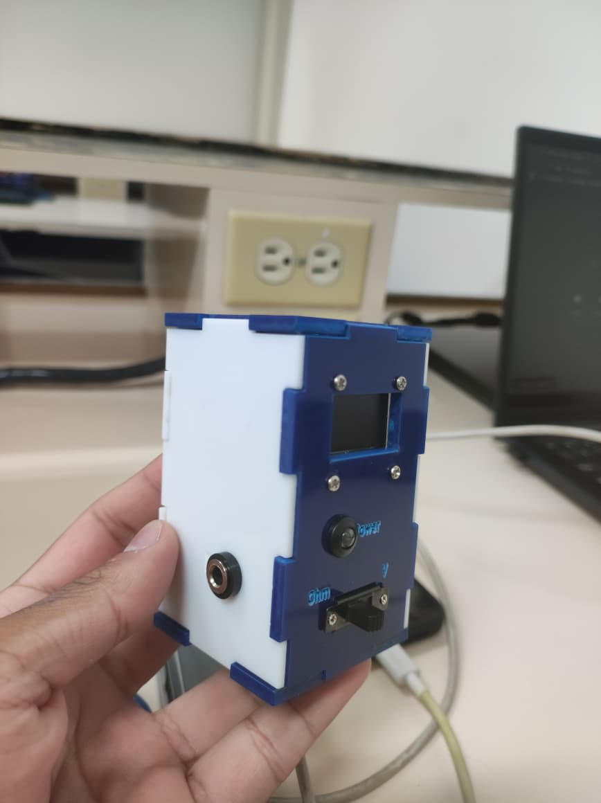
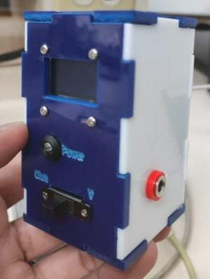

# 📟 Digital Voltmeter and Ohmmeter using ESP32

This project implements a **digital voltmeter and ohmmeter** based on an **ESP32 microcontroller**, featuring a graphical user interface displayed on a **128x64 SSD1306 OLED screen**.

The device operates as a basic electronic measuring instrument, capable of switching between voltage and resistance measurement modes using a digital input.

---

## 🎯 Project Overview

The system provides:

* 🔌 **DC voltage measurement** using a resistive voltage divider
* 🧮 **Resistance measurement** using a software-controlled auto‑ranging method
* 📟 Real‑time visualization with animations on an OLED display

The firmware is written using the **Arduino framework**, and most of the system behavior is defined directly in the main `.ino` file.

---

## 🛠️ Hardware Overview (No Schematic)

A complete electrical schematic is **not included** in this repository. The project was developed as an experimental and educational prototype, and the hardware connections are defined implicitly by the firmware.

However, the hardware can be described at a **functional level**, based strictly on the code:

### Main Components

* **ESP32 development board**
* **OLED Display**: 128x64 SSD1306 (I2C)
* **Reference resistors for ohmmeter auto‑ranging**:

  * 1 kΩ
  * 10 kΩ
  * 100 kΩ
* **Voltage divider** for DC voltage measurement
* **Mode selection input** (digital)
* **Status LED**

### Functional Pin Usage (as defined in firmware)

| Function     | Description                                             |
| ------------ | ------------------------------------------------------- |
| `OhmMeter`   | Analog input used for resistance measurement            |
| `voltMeter`  | Analog input used for voltage measurement               |
| `R1, R2, R3` | Digital pins controlling reference resistors            |
| `modeInput`  | Digital input for mode selection (Voltmeter / Ohmmeter) |
| `LED`        | Digital output for status indication                    |

> ⚠️ **Note:** Pin numbers and electrical topology must be inferred from the firmware. No assumptions beyond what is explicitly implemented in the code are made.

---

## ⚙️ Measurement Principles

### Voltmeter Mode

* The ESP32 ADC samples the voltage through a resistive divider.
* Multiple ADC readings are averaged to reduce noise.
* The measured ADC value is scaled using a calibration factor defined in the firmware.

### Ohmmeter Mode

* The system uses **three reference resistors** to implement auto‑ranging.
* A **finite state machine** sequentially enables each resistor.
* ADC readings are averaged and converted into resistance values.
* The most suitable range is automatically selected in software.
* Over‑range and under‑range conditions are detected and displayed.

---

## 🚀 Main Features

* 🔁 Dual measurement modes: Voltmeter and Ohmmeter
* 🧠 Software‑based auto‑ranging resistance measurement
* 📊 ADC averaging for stable readings
* ⚠️ Over Load / Under Load detection
* 🎞️ Animated OLED graphical interface
* 💡 LED status indicator

---

## 🎥 Project Demo

Click the image below to watch the full demonstration video on YouTube:

[](https://www.youtube.com/watch?v=PJW9BegS53k)

---

## 📸 Project Photos

Below are two photographs of the physical prototype:





---

## 🛠️ Technologies Used

* **Microcontroller:** ESP32
* **Programming Language:** C / C++
* **Framework:** Arduino
* **Display:** SSD1306 OLED (128x64)
* **Libraries:**

  * Adafruit_SSD1306
  * Adafruit_GFX

---

## 📥 Installation

### Requirements

* Arduino IDE
* ESP32 board support installed
* USB cable

### Steps

1. Clone this repository:

```bash
git clone https://github.com/your-username/your-repository-name.git
```

2. Open the `.ino` file in **Arduino IDE**.
3. Install required libraries using the Arduino **Library Manager**.
4. Select the appropriate **ESP32 board** and **COM port**.
5. Upload the sketch to the board.

---

## 🧠 Learning Outcomes

* Practical use of the ESP32 ADC
* Noise reduction through sampling and averaging
* Implementation of a software‑based auto‑ranging ohmmeter
* State machine design for measurement sequencing
* Embedded graphical interface development

---

## 🔮 Future Improvements

* Add a complete electrical schematic
* Improve ADC calibration accuracy
* Add current measurement mode
* Implement serial data logging

---

## 📄 License

This project is released under the **MIT License**.

## 👤 Authors

Developed by:
- [Víctor Camilo Cañón Castellanos](https://github.com/vcanonc)
- [Santiago Jesus Gomez Gil](https://github.com/sjgomezg)
